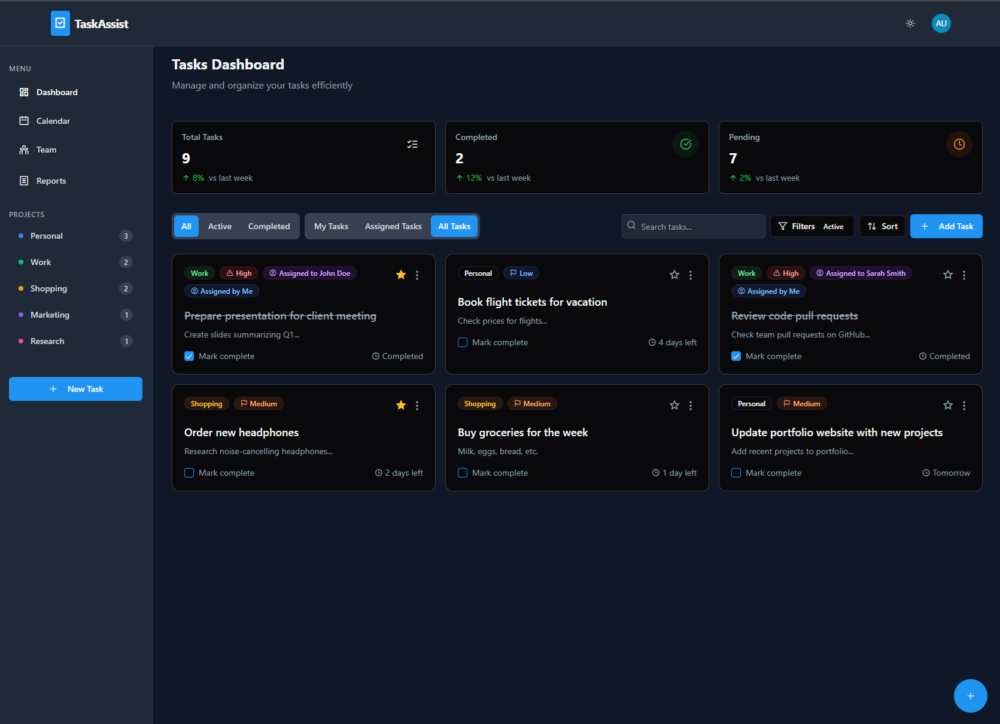
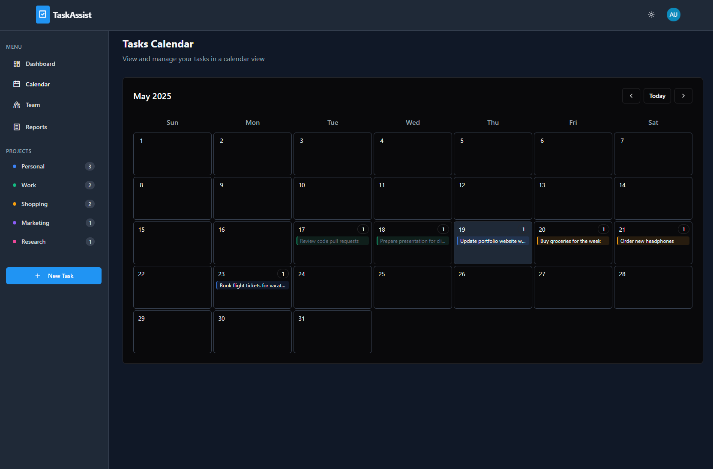
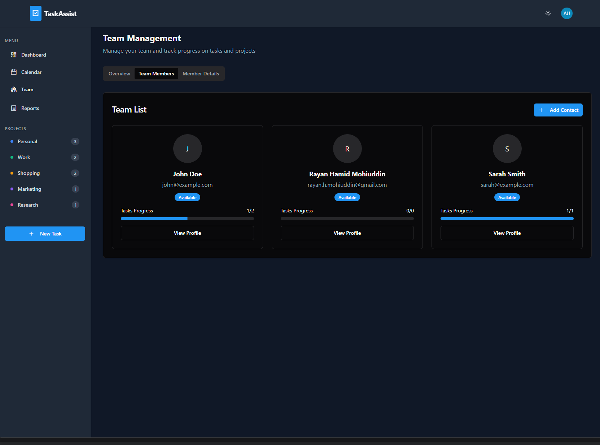
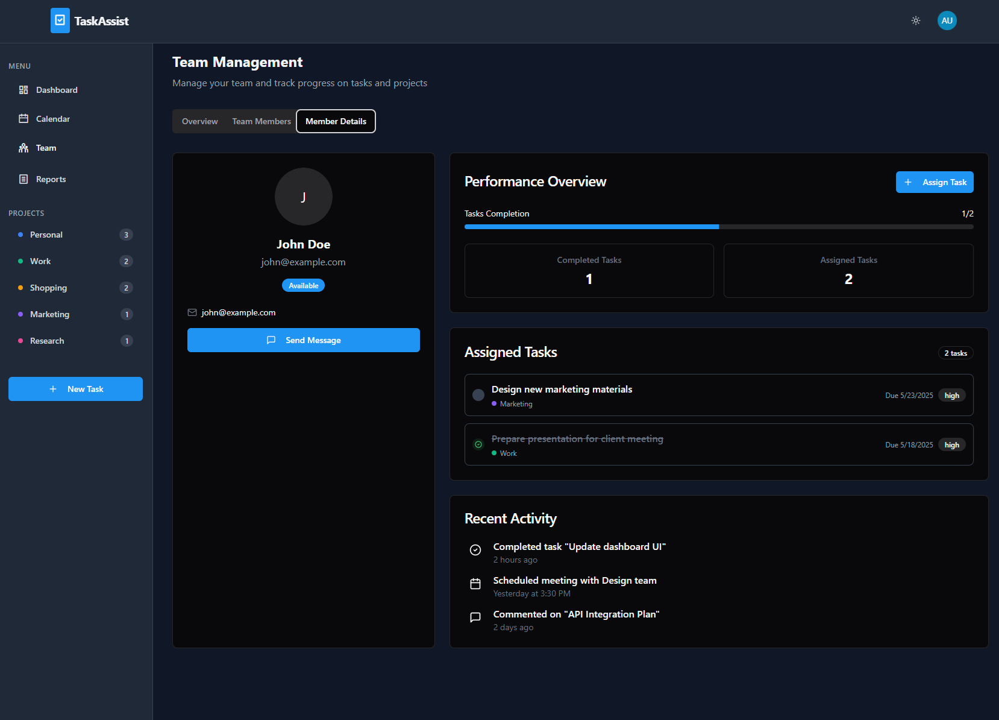

# TaskAssist 🗂️✨

A full-stack **to-do / team-task** platform powered by a **Spring Boot 3** API and a **React + Vite** front-end.

---

## 📸 Demo Screenshots

### Dashboard and Calendar

<div style="display: flex; gap: 1rem;">
  <div style="flex: 1; aspect-ratio: 16 / 9; overflow: hidden;">
    
  </div>
  <div style="flex: 1; aspect-ratio: 16 / 9; overflow: hidden;">
    
  </div>
</div>

### Team Members and Member Details

<div style="display: flex; gap: 1rem; margin-top: 1rem;">
  <div style="flex: 1; aspect-ratio: 16 / 9; overflow: hidden;">
    
  </div>
  <div style="flex: 1; aspect-ratio: 16 / 9; overflow: hidden;">
    
  </div>
</div>

---
## ✨ Features

| Domain       | Highlights                                             |
| ------------ | ------------------------------------------------------ |
| **Auth**     | JWT login / register / refresh / `/me`, bcrypt hashing |
| **Tasks**    | CRUD, deadlines, priority, `/summary`, filter by user  |
| **Teams**    | Assign tasks to teammates, list team members           |
| **Calendar** | iCal-style deadlines (already built)                   |
| **UI**       | Dark / Light toggle, fully responsive                  |
| **Dev XP**   | Hot-reload (Spring DevTools + Vite), Docker-ready      |

---

## 🏗️ Tech Stack

* **Spring Boot 3.4 / Spring Security 6** – REST API, stateless JWT
* **PostgreSQL 16** – persistence via Spring Data JPA + Hibernate 6
* **React 18 & Vite 5** – lightning-fast HMR, modern build
* **Axios** – HTTP client with interceptor for JWT
* **Docker / Compose** – one-command container workflow
* **JUnit 5 / Mockito** – back-end tests, **Vitest** – front-end tests

---

## 📂 Project Layout

```
TaskAssist/
├─ taskassist-backend/          # Spring Boot + Maven wrapper
│   ├─ src/main/java/com/taskassist/…
│   ├─ src/main/resources/application.properties
│   └─ start.ps1 / start.sh     # one-liner launcher
│
├─ src/ (or client/)            # React front-end (Vite)
│   ├─ vite.config.ts           # /api proxy → Spring
│   └─ tsconfig.json
│
├─ package.json                 # front-end scripts & deps
└─ README.md
```

---

## 🚀 Quick Start (Local Dev)

### 1  Prerequisites

| Tool           | Version                         |
| -------------- | ------------------------------- |
| **JDK**        | 17 / 21 (22 works)              |
| **Node + npm** | ≥ 18                            |
| **PostgreSQL** | ≥ 13 (DB name `taskassist`)     |
| **Maven**      | not required (wrapper included) |

### 2  Clone & install

```bash
git clone https://github.com/<your-handle>/TaskAssist.git
cd TaskAssist
npm install                 # front-end deps
```

### 3  Back-end → terminal #1

```powershell
cd taskassist-backend
.\start.ps1                 # Windows
# ./start.sh               # macOS / Linux
```

Tomcat starts on [**http://localhost:8080**](http://localhost:8080)

### 4  Front-end → terminal #2

```bash
npm run dev                 # Vite on http://localhost:5000
```

---


## 🔐 Config / Env Vars

| Key                          | Default                                       | Notes                |
| ---------------------------- | --------------------------------------------- | -------------------- |
| `SPRING_DATASOURCE_URL`      | `jdbc:postgresql://localhost:5432/taskassist` | DB URL               |
| `SPRING_DATASOURCE_USERNAME` | `postgres`                                    |                      |
| `SPRING_DATASOURCE_PASSWORD` | `8426`                                        |                      |
| `JWT_SECRET`                 | `change-me-in-prod`                           |                      |
| `SERVER_PORT`                | `8080`                                        | override Tomcat port |

Create `.env` (used by Docker & scripts).

---


## 📜 License

[MIT](LICENSE)

> *TaskAssist is a portfolio project — PRs & feedback welcome!*

```}
```
